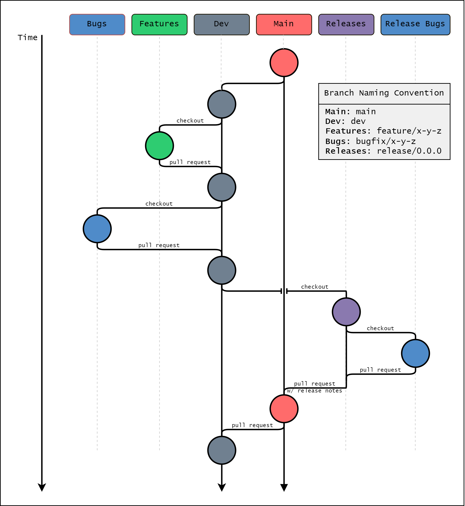

# Contributing to `gpras`

Welcome to the `gpras` team! We welcome any and all collaboration that meets out minimum quality requirements. The guidelines below provide example tasks and environment setup.

## How you can contribute

1. Report bugs
   - When you identify a bug, search the issues page to see if it has already been reported
   - If not, create a new issue and describe the bug.  Be sure to include
     - A clear and descriptive title.
     - Steps to reproduce the bug.
     - Expected vs observed behavior.
     - Proposed solutions (if you have any).
     - Labels (bug, enhancement, high priority, etc.).
2. Feature adds
   - When you identify a potential new feature or enhancement, search the issues page to see if it has already been proposed
   - If not, create a new issue and describe the idea.  Be sure to include
     - A clear and descriptive title.
     - A detailed description of the proposed improvement.
     - A reference to any relevant bugs.
3. Code changes
   - We welcome contributions to this codebase. Members of the FEMA-FFRD organization may create new branches within this repository, and outside organizations may fork this repository to create new branches. Make sure to follow the branching strategy below! Once a feature or bugfix branch has been created, please take the following steps.
   - Ensure your code has passed the pre-commit checks, including
     - Are you following [PEP 8](https://peps.python.org/pep-0008/)?
     - Do all functions have docstrings?
     - Is type-hinting used throughout?
     - Has black formatting been applied?
   - Ensure all tests are passing (run `pytest`).
   - Ensure no files or print statements have been committed accidentally.
   - Ensure any required dependancies have been added to pyproject.toml.
   - Submit a pull-request.  Be sure to fill out the pull-request template.
   - If you have a reviewer in mind, assign the PR to them.
   - Respond to all reviewer comments and update code accordingly.

## Branching Strategy

## Summary


## Branching process

1. Planning
   - Identify bugfixes and feature adds for a new release.
   - Set up a milestone.
   - Assign issues.
2. Create any number of appropriately-named branches to address bugfixes and features.
3. Implement changes.
4. Each assignee submits PRs for their branches to `dev`.
5. Once approved, merge each PR to `dev`.
6. Check out a `release/0.0.0` branch.
   - 0.0.0 should be replaced with actual version number.
   - Bugfix releases increment 0.0.1 whereas
   - feature releases increment 0.1.0.
7. Release preparation.
   - Update \_\_version\_\_ in `__init__.py`
   - Run any required production tests.
   - (optional) If necessary, check out a bugfix branch for last-minute updates. Merge back to the `release/0.0.0` branch after PR & review.
8. Release
   - Submit PR from `release/0.0.0` branch to `main`.
   - Approve the PR. Merge release into `main`.
   - Add release notes to GitHub release.
9. Submit PR from `main` to `dev` to catch up version and any release bugs.

## Setting up a development environment

This repository will inevitably have many dependancies. Managing a development environment is ultimately the responsibility of each developer, however, several options are provided to ease environment management.

### Option 1: Development container

We suggest developers use the dev container provided in this repository.  To develop in a container, take the following steps

1. Install and configure [docker](https://www.docker.com/get-started/) for your system.
2. Install [Visual Studio Code](https://code.visualstudio.com/).
3. Install the [Dev Containers extension](https://marketplace.visualstudio.com/items?itemName=ms-vscode-remote.remote-containers)
4. Start VS Code and run the **Dev Containers: Open Folder in Container...** command from the Command Palette `(F1)`

Then you're off to the races!

### Option 2: pip virtual environment

1. Create new virtual environment.
```bash
python -m venv .venv
```
2. Activate the environment.

**Windows**
```bash
.venv\Scripts\activate
```
**Linux**
```bash
source .venv/bin/activate
```
3. Install the module (with dev optional dependancies) in editable mode.
```bash
pip install -e .[dev]
```
4. Install pre-commit.
```bash
pre-commit install
```

This approach could also be used with conda, mamba, or  uv.
