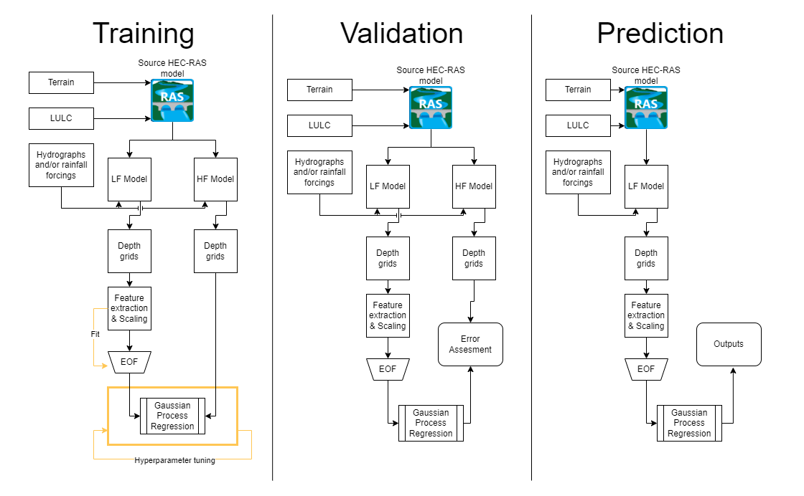

# Surrogate Modeling of HEC-RAS using Gaussian Process Regression
[](.github/workflows/ci.yml)
[](LICENSE)
[](https://github.com/fema-ffrd/gpras/releases)
[](https://github.com/fema-ffrd/gpras/issues)


HEC-RAS is a widely used tool for modeling river hydraulics and flood events; however, its detailed computational simulations can be time-consuming and resource-intensive, especially when performing stochastic simulation with many thousands of storm events. This software provides research- and production-level tooling to emulates HEC-RAS outputs with significantly reduced computation time via Gaussian Process Regression (GPR).  The GPR surrogate models may be used to predict flood depths from a variety of input configurations, including

1. Lower-fidelity HEC-RAS models (models with coarse grid resolution),
2. HEC-HMS reach-level stage or discharge hydrographs, and
3. Reach inflow hydrograph features.

The surrogate models are trained to reproduce the outputs of a high-resolution "benchmark" model that must be developed by the user beforehand. Parameters of the GPR surrogate are optimized to predict the benchmark flooding given a set of input features relating to either the benchmark model forcing or outputs from a lower-fidelity HEC-RAS model. A graphical summary of the training and predicting process is shown in the image below.

### Model Training and Validation
<div align='center'>
    
</div>

### Model Data Layout
<div align='center'>
    
</div>

## Installation

To use this software, please use either the [devcontainer](./.devcontainer/devcontainer.json) or clone this repo and install with pip.


```bash
git clone https://github.com/fema-ffrd/gpras.git
pip install .
```

[!IMPORTANT]
If not using the devcontainer, you will need to install hecdss manually.  This package is not available on PyPI.

To install [hecdss](https://github.com/HydrologicEngineeringCenter/hec-dss-python), run the following commands.
```bash
pip install -i https://test.pypi.org/simple/ hecdss
python -c "from hecdss import download_hecdss"
```
