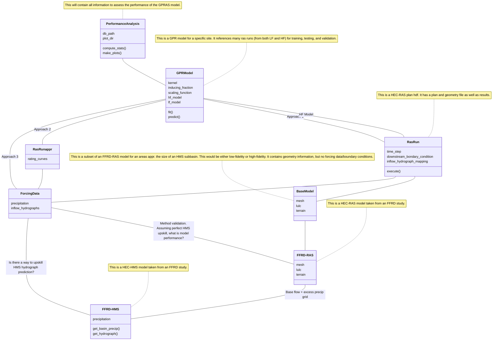

```mermaid
classDiagram
    FFRD-RAS -- FFRD-HMS : Base flow + excess precip grid
    Ras Run -- Forcing Data
    Forcing Data -- FFRD-HMS : Is there a way to upskill HMS hydrograph prediction?
    Forcing Data -- FFRD-RAS : Method validation. Assuming perfect HMS upskill, what is model performance?
    Base Model -- FFRD-RAS
    Ras Run -- Base Model
    Ras Run appr -- Forcing Data
    GPR Model -- Forcing Data : Approach 3
    GPR Model -- Ras Run appr : Approach 2
    GPR Model -- Ras Run : Approach 1
    GPR Model -- Ras Run : HF Model
    Performance Analysis -- GPR Model
    class Forcing Data{
        precipitation
        inflow_hydrographs
    }
    class FFRD-HMS{
        precipitation
        get_basin_precip()
        get_hydrograph()
    }
    class Base Model{
        mesh
        lulc
        terrain
    }
    class FFRD-RAS{
        mesh
        lulc
        terrain
    }
    class Ras Run{
        time_step
        downstream_bondary_condition
        inflow_hydrograph_mapping
        execute()
    }
    class Ras Run appr{
        rating_curves
    }
    class GPR Model{
        kernel
        inducing_fraction
        scaling_function
        hf_model
        lf_model
        fit()
        predict()
    }
    class Performance Analysis{
        db_path
        plot_dir
        compute_stats()
        make_plots()
    }
    note for Base Model "This is a subset of an FFRD-RAS model for an areas appr. the size of an HMS subbasin. This would be either low-fidelity or high-fidelity. It contains geometry information, but no forcing data/boundary conditions."
    note for FFRD-RAS "This is a HEC-RAS model taken from an FFRD study."
    note for FFRD-HMS "This is a HEC-HMS model taken from an FFRD study."
    note for Ras Run "This is a HEC-RAS plan hdf.  It has a plan and geometry file as well as results."
    note for GPR Model "This is a GPR model for a specific site. It references many ras runs (from both LF and HF) for training, testing, and validation."
    note for Performance Analysis "This will contain all information to assess the performance of the GPRAS model."
```
